# SimVascular Guide

This guide walks through the general workflow for **SimVascular**, an open-source software that provides a complete pipeline from medical image data segmentation to patient-specific blood flow simulation and analysis.

> ⚠️ **Note:** SimVascular does **NOT** automatically save your work. Make sure to routinely save (by clicking the floppy disk icon in the top left).

## Pipeline Overview

The SimVascular image-based modeling pipeline comprises the following steps:

1. **[Image visualization](#step-1-image-visualization)** — Identify anatomic features in the imaging data
2. **[Path planning](#step-2-path-planning)** — Vessel centerline geometry is created using 2D image slices to identify vessel lumens
3. **[Segmentation](#step-3-segmentation)** — Vessel lumens are segmented from 2D slice probes of 3D image data oriented perpendicular to positions along paths
4. **[Modeling](#step-4-model-generation)** — A geometric model of a vessel is created by generating a surface fitted to groups of 2D segmentations. Individual vessels are then joined together to form a complete 3D solid model of vascular anatomy.
5. **[Meshing](#step-5-meshing)** — A finite element mesh is generated from the 3D solid model
6. **Simulation** — Perform a finite element computational fluid dynamics (CFD) simulation of blood flow in the vascular anatomy

Below are some things to know when completing each step.

---

## Step 1: Image Visualization

- For this step, you will need to import a `.dcm` file (corresponding to a CT scan of an image).
  - In medical imaging, DCM is the file extension used for **DICOM**, which stands for *Digital Imaging and Communications in Medicine*. It is the universal global standard format used to store, transmit, and view patient scans such as MRIs, CTs, X-rays, and ultrasounds.
- To mount a CT scan into your application: `SimVasc → Open Images → Computer → / → mnt → c → Users → [whatever path the image is in your computer]`.
- When importing a scan, the image folder will contain hundreds of `.dcm` files, starting at `001`. To upload a full scan, it is crucial that you select `001.dcm` to import, as a DICOM file will include all files after itself in number order.
- You will also be asked to scale the image upon importing into SimVascular.
  - Make sure your image is scaled to cm (**0.100 scaling factor** from mm to cm).
- **Important:** You have to open the image *before* opening the SV Project. The SV project alone does not hold the image data — rather, it goes over the image.

---

## Step 2: Path Planning

Finding the first point is always the most difficult part of creating a path. Here is a screenshot of generally where to locate the starting point to the main aortic pathway:

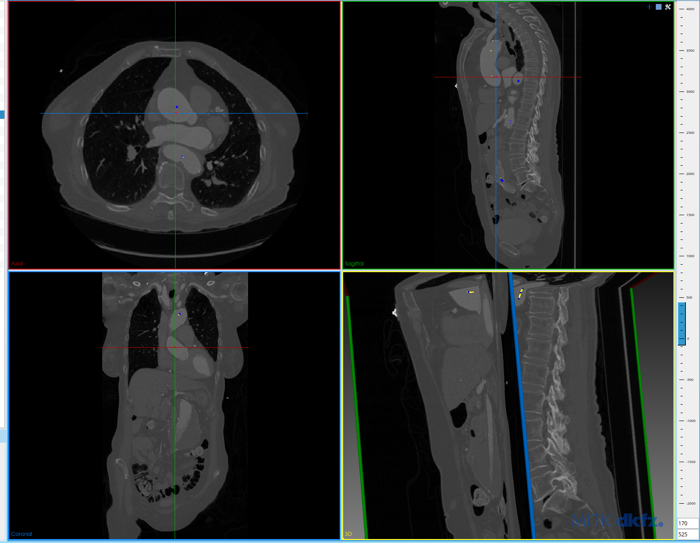

### YouTube Tutorial Links

- [SimVascular Tutorial 1: Loading and Manipulating Image Data](https://www.youtube.com/watch?v=aX7lEGRhGxQ)
- [SimVascular Tutorial 2: Creating Centerline Paths](https://www.youtube.com/watch?v=EHiSokUqSIw)
- [SimVascular Tutorial 3: 2D Segmentations with Level Set and Manual](https://www.youtube.com/watch?v=jlfkVmOU8-w)
- [SimVascular Tutorial 4: Machine Learning 2D Segmentation](https://www.youtube.com/watch?v=rSfzhiMOLpU)


Once you find the starting point of the main aortic branch, follow its path by moving up and down the slices in the axial view, and centering the points made in that artery. Also try to keep the points centered in the other views.

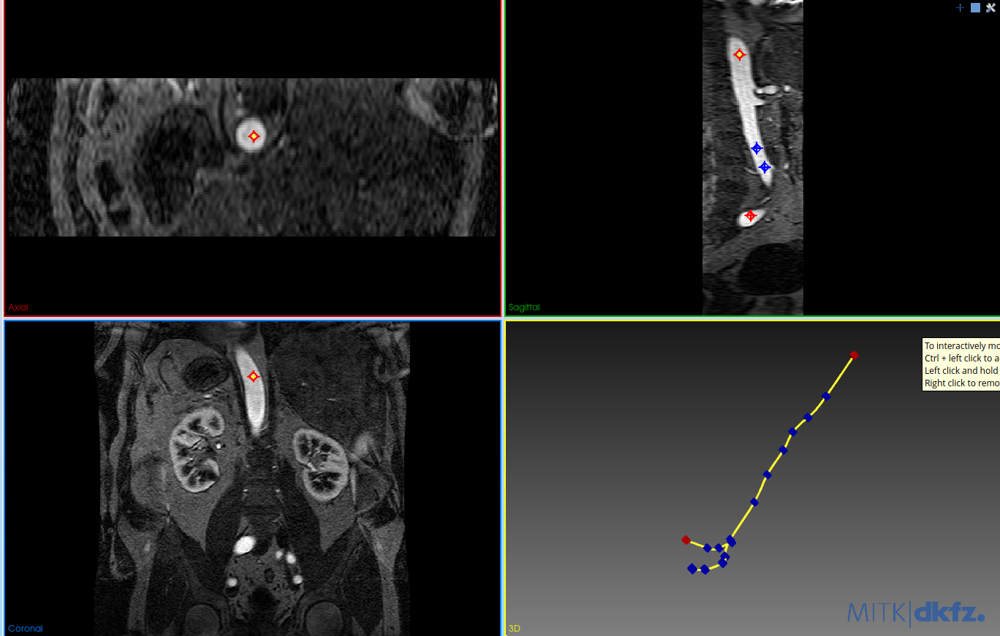

At the place where the aorta branches into two, start a new path going into the right femoral artery.

### Handling Bifurcations

It is important to note that at any bifurcation, there must be one point that exists in both paths. (For example: when creating the path of the R femoral artery, its "0" point must be a point in the aorta.)

Here are the steps to do that:

1. Create the branched artery's (ex. R femoral artery) path such that it does **not** intersect with the main vessel yet (ex. aorta).

   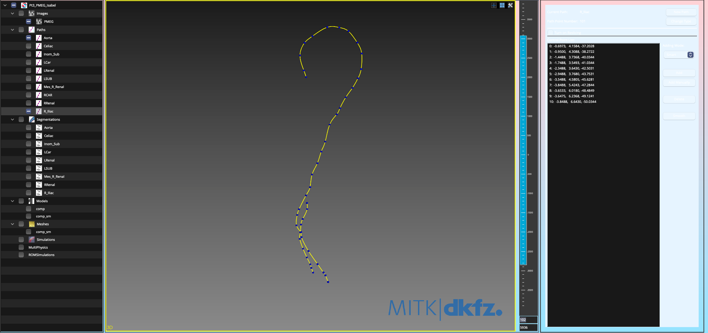

2. Look at the trajectory of the branched artery and find the closest point on the main vessel path.

   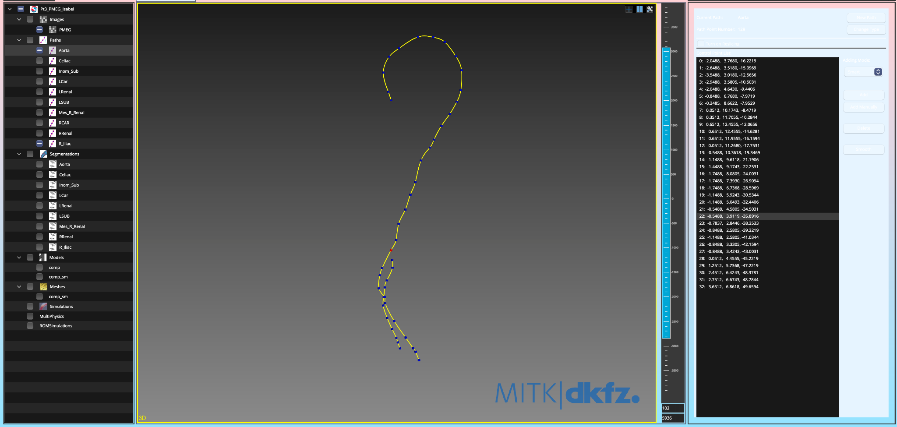

3. Go to the main vessel path group (select and open) and find & screenshot the coordinates of the selected point.

4. Go back to the branched artery path group, click **"Add Manually"** (button located underneath "Add") and manually input the coordinates of the selected point.

   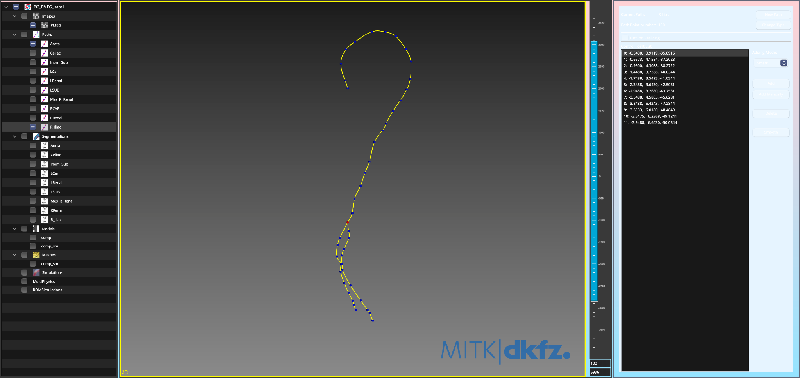

---

## Step 3: Segmentation

After every couple of points along the path, use the **SplinePoly** tool to trace around the artery at that given point. Some tips to keep in mind:

- When using the SplinePoly, try to use as little amount of points as possible and don't stress yourself out over details. This allows for a smoother model.

| Raw | Simplified |
|---|---|
| 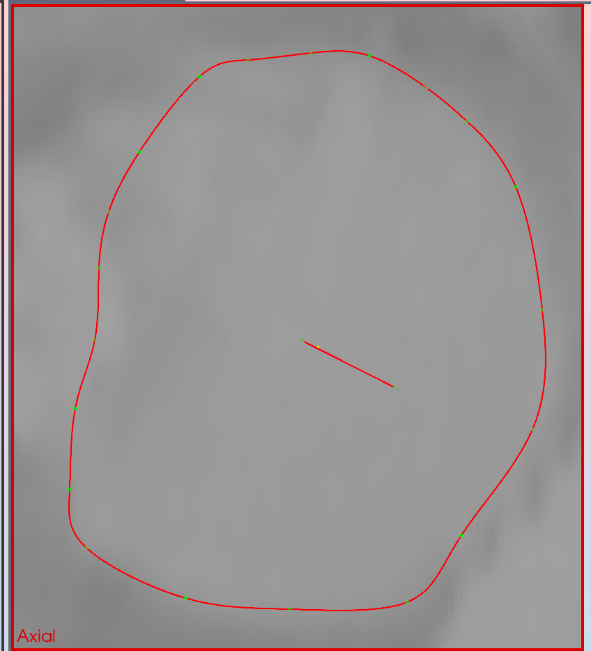 | 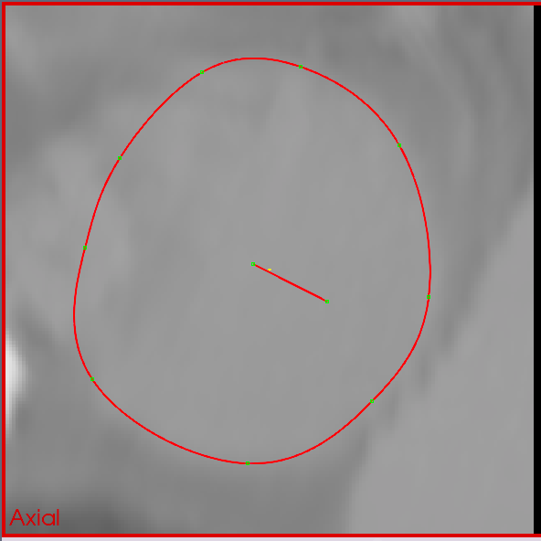 |

- **Don't go overboard with segmenting!** If a vessel can be accurately modeled using 2 segmentations instead of 5, please do so. When two segments are too close together, this often creates folds in the model.
  - The pipeline that has been used is to do an initial sweep of the vessel: segmenting every 5 or so slices. Then, after the vessel is done, go through the segmentations to determine which are actually needed. (The **"Lofting Preview"** is VERY helpful in this step because you can see how the model would look based on the segments already made. And when going through the slices you can view how it looks on the images, as they will appear as white solid shapes.)

| Folds (too many/close segments) | Simplified (smooth) |
|---|---|
| 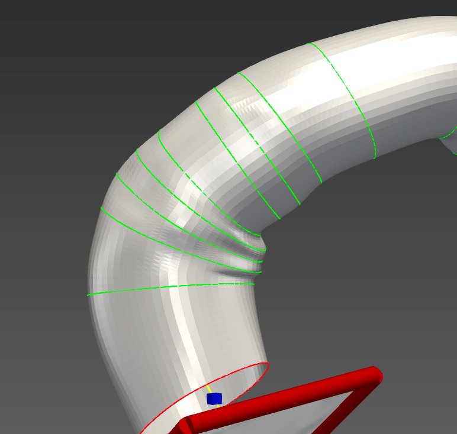 | 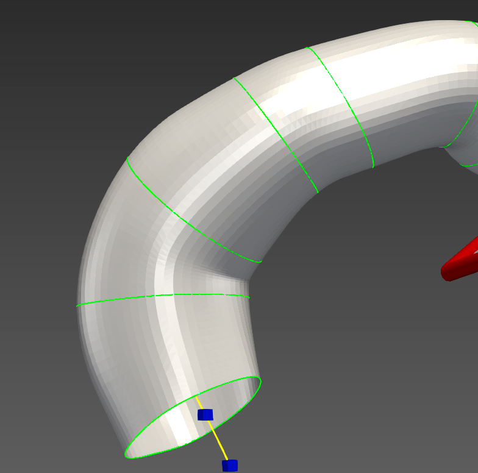 |

- If modeling the aorta where a stent-graft is present, be sure to outline the **INNER LINING** of the stent-graft.
- Keep in mind your angles. When segmenting, to decrease the amount of "folds" in your geometry, try to ensure that your segmentations have the same angle. One way to do this is to edit your path groups so that:
  - There are fewer points in your path (which will decrease the amount of twists and turns in your plane).
  - There are no sharp turns (to help with curves in the vessel).
  
  > **Note:** By doing this, your path may no longer be in the center of the vessel. Use your path as a way to guide which vessel you're looking at, even if it isn't in the center.
  >
  > **Note 2:** Some folds are just going to occur, but just try your best to help with smoothing later on :)

- You can generate a model after segmentation; however, be prepared to encounter issues, as sometimes the segmentations don't overlap well and there are holes in your geometry.

### Segmenting Branched Arteries

- Make sure that the "0" shape on branched vessels are at least **2 "clicks"** fully within the main vessel. The best method is:
  - Create the contour group of the branched artery such that the first slice is where you can clearly see the separation of the branched artery.
  - Display the lofting preview of the main vessel.
  - Go to the branched artery contour group and copy the first slice.
  - Scroll towards the main vessel such that it is the earliest slice where the copied slice is fully within the lofted main vessel preview (as seen below).

  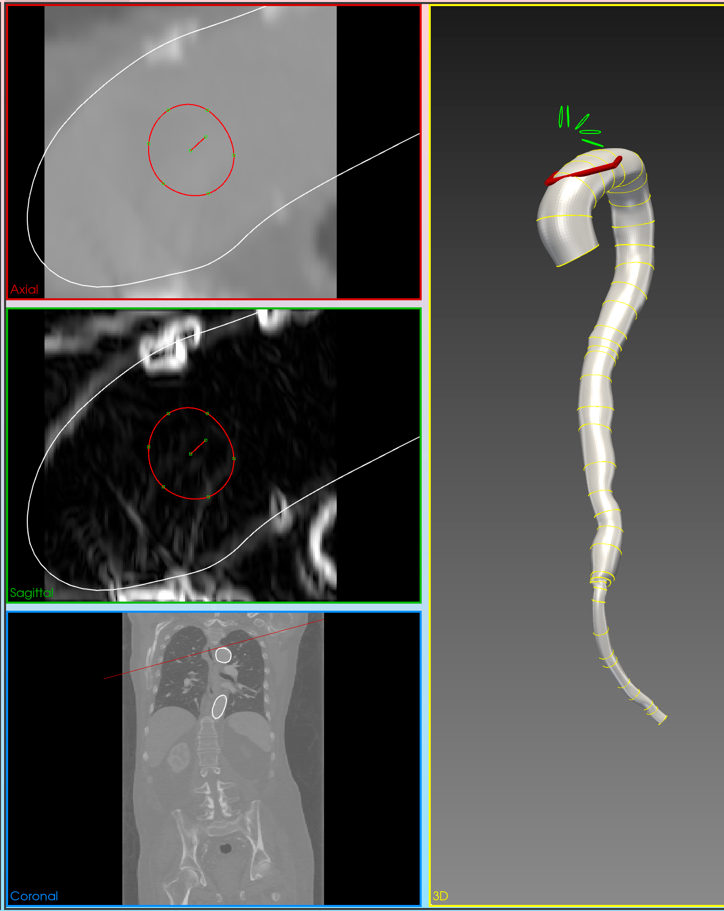

- Best practice is that the branched arteries intersect with the main vessel as close to 90 degrees as possible. (Won't always be possible.)

---

## Step 4: Model Generation

### Step 4a: Modeling

Modeling lofts the segmentations together, forming a 3D geometry.

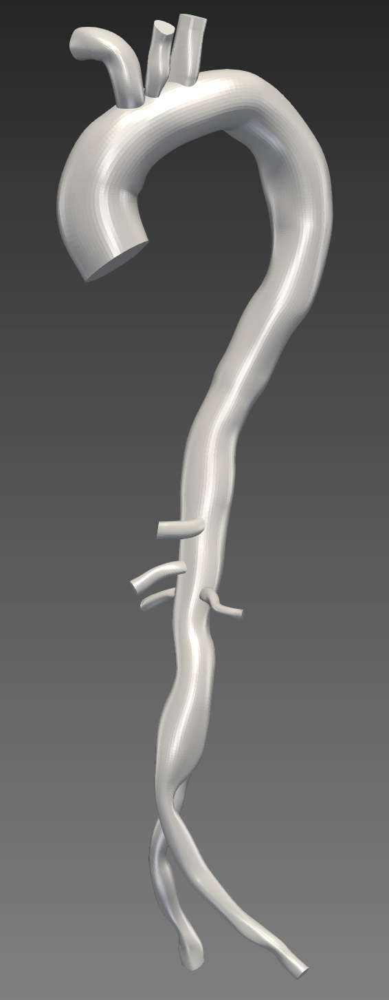

**Tips for model generation:**

- Start by lofting (creating a model) of individual path segments before attempting to generate the whole model.
  - This will eliminate guesswork down the line in case an error occurs and SimVascular is unable to generate the model.
- Typically, problems with model generation occur at the bifurcations of the arteries.
  - When segmenting, the first segmentation of the new branch must be fully within the main vessel it is stemming from.
- Check the wall/cap information:
  - Make sure that the number of caps listed matches the number of caps that actually exist (hint: the only vessel that should have 2 caps is the Aorta).
  - If another vessel has 2 caps, that means its "0" slice is not fully inside the main branch.

### Step 4b: Smoothing

Before smoothing, make sure that your regular model can properly be exported.

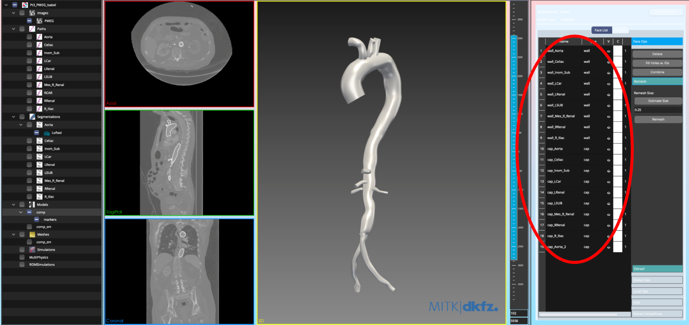

1. Select your model (make sure that it is the only model with the box filled in blue), right-click → **"Export Solid Model"** → name your model and add `.stl` at the end.
   - Repeat this process, but instead of `.stl`, write `.vtp`.
     - `.stl` is to open in MeshMixer, and `.vtp` is to run the python script.
2. Open MeshMixer → Import → select the `.stl` file.
3. Wait for the model to load, then click **"Export"** → rename the file and add `.ply` at the end.
4. See [Running the Python Script Pipeline](#running-python-script-pipeline) and complete those steps.
   - *Note that your `.ply` file is the "Smoothed .ply file" even though you didn't smooth it!*
   - *Make sure to name the output `.vtp` file something DIFFERENT than the original.*
5. Import the new `.vtp` file back into SimVascular (steps located under [Running the Python Script Pipeline](#running-python-script-pipeline)).
   - If the model looks normal, go back to MeshMixer and start smoothing!
   - If the model looks funky, save the project, quit SimVascular, and open it again. Then try again from step 1.
   - If the model still looks funky, look through your segmentation again for:
     - Crossing segmentations
     - Branched arteries not completely in the main artery
     - Excessive segmentations

After successful model generation, you must export the model as a `.stl` file to import into MeshMixer, in order to smooth it.

#### Smoothing in MeshMixer

Once in MeshMixer, there are two ways to smooth:

1. **Sculpt → Brushes → BubbleSmooth / Flatten** — *YOU MUST toggle off "Enable Refinement"*
   - **Bubble Smooth:** Use this for regular smoothing, i.e. simple branches that are easily visible (see image below). Be sure to experiment with sizing and strength.
   - **Flatten:** This is best for really sharp edges.

   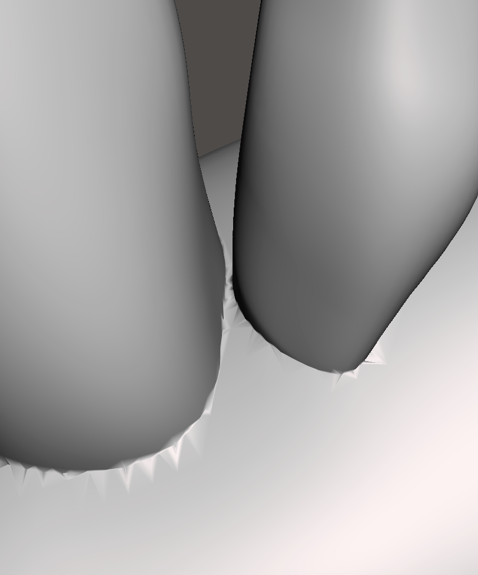

2. **Select → Sphere Brush** (select the regions you want to smooth) **→ Deform → Smooth**.
   - This tool is best for tight spaces, filling holes/tears created by the bubble smooth (solution: highlight only the hole/tear, then decrease constraint rings), and spinal branches (see examples below).

| Tight spaces (b/w vessels) | Tear/Hole made from bubble smooth | Spinal Branches |
|---|---|---|
| 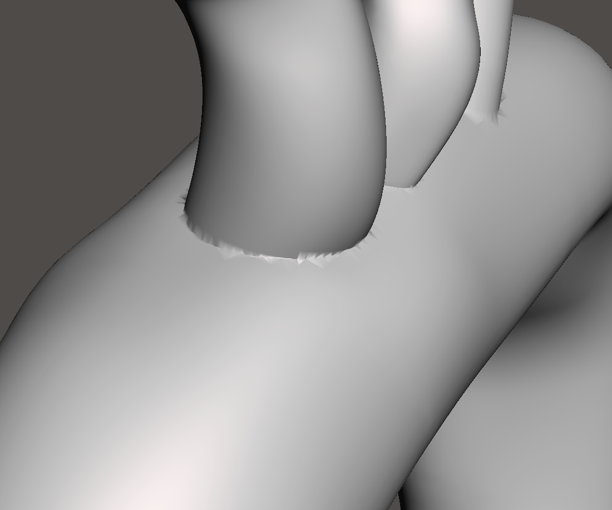 | 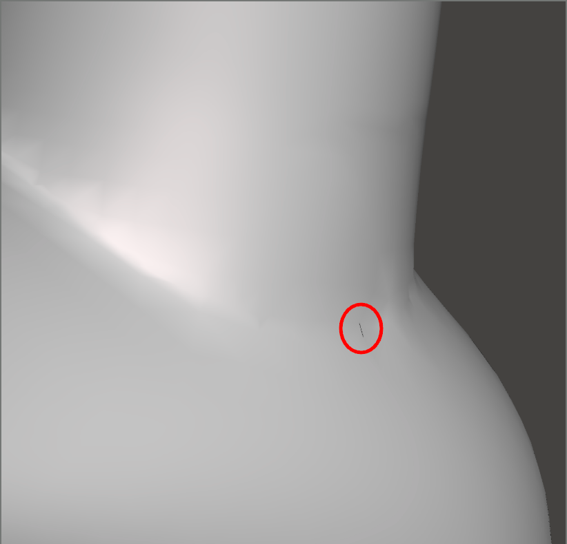 | 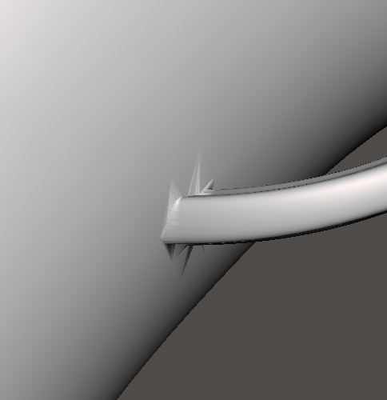 |

> ⚠️ The tear/hole shown above may be small, but it **will crash your mesh**.

- Export the smoothed model from MeshMixer as a `.ply` file.

We previously encountered a problem when reimporting the smoothed file into SimVascular, where all facenames data for the walls and endcaps of the model is lost. To fix this, we have developed a script that can reintegrate this information into the smoothed file from MeshMixer.

Once smoothing is complete, use the **`retain_facenames_after_sm.py`** script, which keeps the facenames data for the walls & endcaps of the model.

**What you will need for the script:**

- `ORIGINAL_VTP`: Original model from SimVascular (as a `.vtp` file)
  - Write the name of this file in `ORIGINAL_VTP = "___.vtp"`
- `SMOOTHED_PLY`: Smoothed model from MeshLab/MeshMixer (as a `.ply` file)
  - Write the name of this file in `SMOOTHED_PLY = "___.ply"`

**What the script gives you:**

- `OUTPUT_VTP`: The smoother model as a `.vtp` file that can be imported back into SimVascular.
  - In this part of the script, put the name you want for this file in `"___.vtp"` (leave the `.vtp` extension).

### Running Python Script Pipeline

*(You will need to install Visual Studio Code.)*

1. Ensure that the python script, `Original.vtp` file, `Original.vtp.facenames` file (which automatically exports with the `Original.vtp` file), and `Smoothed.ply` file are all in the **same folder**.
2. Open the python script in Visual Studio Code and input the names of your files into the following variables:
   ```python
   ORIGINAL_VTP = "*original vtp file name*.vtp"
   SMOOTHED_PLY = "*smoothed model ply file name*.ply"
   OUTPUT_VTP = "*what you want the smoothed model file name to be*.vtp"
   ```
3. In the terminal area, type `cd` then paste the pathname of the folder that your files are located in, and press Enter. Once done, the name of the folder should now be shown in the prompt.
   - On Mac: right-click the folder and hold the "Option" button, then click **"Copy *** as Pathname"**.
4. Type the following and press Enter:
   ```bash
   python3 -m pip install vtk
   ```
5. Type `python3` then paste the pathname of the python script (which should be located in the same folder) and run it.
   - The script should say something like "successfully copied" if done correctly.
   - If the script says the topology changed and that **THE SMOOTHED = 0 POINTS**, the smoothed `.ply` file is not in the selected folder, or its name is spelled incorrectly in the script.
   - Once you complete steps 3–5, to run the script again, just update the variables in step 2 and click the "play" button in the top right corner.

**Import the `.vtp` file back into SimVascular:**

`Right-click "Model" → "Import Solid Model" → select your .vtp file`

---

## Step 5: Meshing

The meshing step will encounter errors if there are any jagged points or holes in the geometry.

| Full Model | Mesh Detail |
|---|---|
| 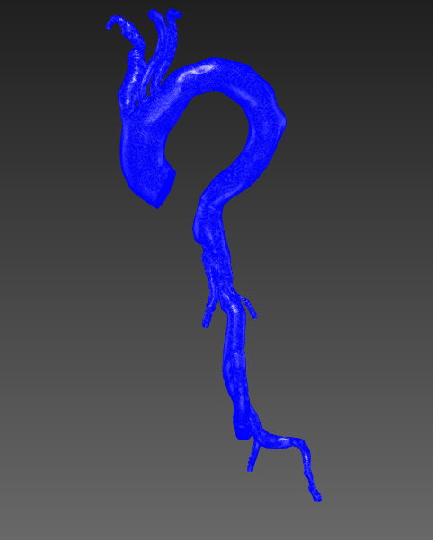 | 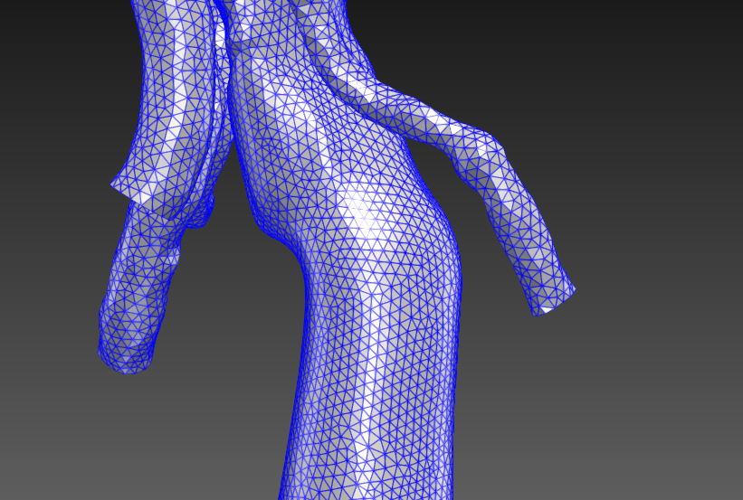 |

When running your mesh, you will need to:

- Toggle **"Boundary Layer Meshing"** ON.
- Set **"Number of Layers"** to `5`.
- Toggle **"Extrude Boundary Layer Inward from Wall"** OFF.

> **Note:** If you are working with vessels of varying sizes (i.e. spinal branches), you will need to work in the **"local size"** section.

**Tip:** Before running your mesh, save your project, close out of SimVascular, and reopen it from your Terminal using the following command (assuming SimVascular is in your Applications folder):

```bash
/Applications/SimVascular.app/Contents/MacOS/SimVascular
```

This will allow you to see error messages, such as if there is a point that is creating a problem. (Solution: inspect in MeshMixer/MeshLab — the smoothing is probably just funky.)

> In order to run accurate simulations, we require the use of boundary layers. For the purposes of our research, we typically use 5 boundary layers. They are intended to mimic the no slip boundary conditions at the vessel walls. 
